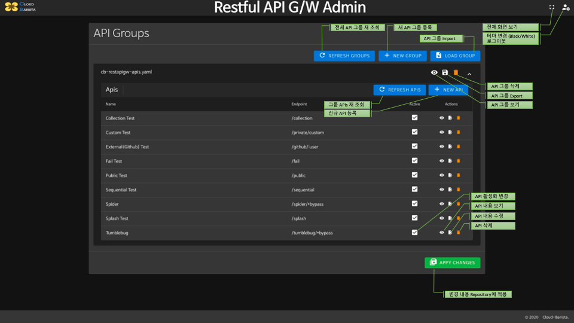
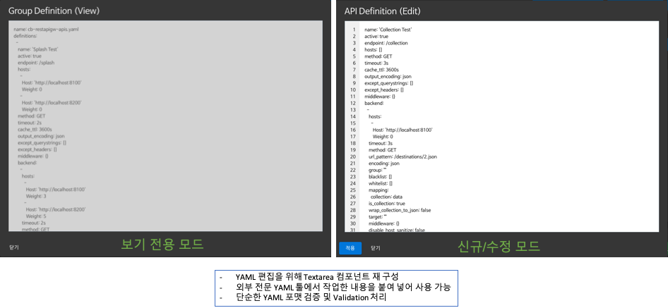

# CB-RESTAPIGW : REST API Gateway in `CB-APIGW`

CB-RESTAPIGW는 PoC (Proof of Concepts) 수준의 RESTful API Gateway 기능을 제공한다.

# [ 목차 ]

- [컨테이너 기반 실행](#컨테이너-기반-실행)
- [Cloud-Barista 시스템 통합 실행 참고 (Docker-Compose 기반)](#cloud-barista-시스템-통합-실행-참고-docker-compose-기반)
- [소스 기반 설치 및 실행](#소스-기반-설치-및-실행)
  - [설치](#설치)
  - [설정](#설정)
  - [실행](#실행)

# [컨테이너 기반 실행]
- CB-RESTAPIGW 이미지 확인(https://hub.docker.com/r/cloudbaristaorg/cb-restapigw/tags)
- CB-RESTAPIGW 컨테이너 실행

```
docker run -p 8000:8000 -p 8001:8001 --name cb-restapigw \
-v /root/go/src/github.com/cloud-barista/cb-apigw/restapigw/conf:/app/conf \
cloudbaristaorg/cb-restapigw:v0.1-yyyymmdd
```

# [Cloud-Barista 시스템 통합 실행 참고 (Docker-Compose 기반)]

```
# git clone https://github.com/jihoon-seo/cb-deployer.git
# cd cb-deployer
# docker-compose up
```

# [소스 기반 설치 및 실행]

## [설치]

설치는 Mac (Catalina) 또는 Ubuntu Latest (Docker Container 사용)버전을 기준으로 한다.

- **Git 설치**
  - Mac 환경
    ```
    $ brew install git
    ```
  - Ubuntu 환경
    ```shell
    # apt update
    # apt install git
    ```

- **YARN 설치 (Admin WEB 빌드용)**
  - Mac 환경
    ```shell
    $ brew isntall yarn
    ```
  - Ubuntu 환경
    ```shell
    # 필요한 패키지 설치
    $ apt-get install -y wget curl gcc make gnupg gnupg1 gnupg2
    # YARN 설치 (Web 빌드용)
    $ apt remove -y cmdtest
    $ curl -sS https://dl.yarnpkg.com/debian/pubkey.gpg | apt-key add -
    $ echo "deb https://dl.yarnpkg.com/debian/ stable main" | tee /etc/apt/sources.list.d/yarn.list
    $ apt-get update && apt-get install -y yarn
    ```

- **Go 설치 (v1.12 이상) - GO Module 사용**
  - Mac 환경
    ```shell
    $ brew install go
    $ export PATH=$PATH:/usr/local/go/bin:/Users/<사용자아이디>/go/bin
    $ which go
    /usr/local/go/bin
    $ go version
    go version go1.15.2 linux/amd64
    $ export GO111MOUDLE="on"
    $ go env
    ```
  - Ubuntu 환경
    - https://golang.org/dl 에서 최신 버전 확인 (현재 1.15.2)
    - 다운로드 및 설치
      ```shell
      # Go 설치 및 확인
      $ wget https://dl.google.com/go/go1.15.2.linux-amd64.tar.gz
      $ tar -C /usr/local -xzf go1.15.2.linux-amd64.tar.gz
      $ export PATH=$PATH:/usr/local/go/bin:/root/go/bin
      $ which go
      /usr/local/go/bin
      $ go version
      go version go1.15.2 linux/amd64
      $ export GO111MOUDLE="on"
      $ go env
      ```
    - 환경 파일을 통해서 설정할 경우는 다음과 같이 처리한다.
      - .bashrc 파일 하단에 경로 관련 추가
        ```txt
        ...
        export PATH=$PATH:/usr/local/go/bin
        ```
      - 적용을 위한 bash 재 실행
        ```shell
        $ source ~/.bashrc
        $ . ~/.bashrc
        ```

- **소스 다운로드**
  ```shell
  # git clone https://github.com/cloud-barista/cb-apigw.git
  ```

- **ADMIN Web 빌드를 위한 툴 다운로드** <br/>
  이 툴은 Admin Web Application의 빌드된 산출물을 Go 소스 파일로 변환(embedding)하기 위한 것이다.
  ```shell
  # go get -u github.com/mjibson/esc
  ```

- **빌드**
  - Mac 환경
    ```shell
    $ cd /cb-apigw/restapigw/web
    $ yarn install
    $ cd /cb-apigw/restapigw
    $ make build
    ```
  - Linux 환경
    ```shell
    $ cd cb-apigw/restapigw/web
    $ yarn install
    $ cd cb-apigw/restapigw
    $ make build-linux
    ```

## [설정]

Configuration 설정은 `YAML` 포맷을 사용한다.

설정은 크게 두가지로 구분된다.

- API G/W 운영을 위한 `시스템 설정`
- API 서비스를 위한 `API 설정`

### <u>시스템 서비스 설정 (서비스 운영 용)</u>

> 기본 경로와 파일은 `./conf/cb-restapigw.yaml` 이며, API G/W 실행 시점에 옵션으로 지정하면 된다.

```shell
cb-restapigw -c ./conf/cb-restapigw.yaml
```

  > 각 설정은 꼭 필요한 사항이 아니면 필수 항목에 대한 설정만으로 동작 가능함

  - 서비스 설정
    - 기본 설정
      | 설정 | 내용 | 필수 | 기본값 |
      |---|---|:-:|---|
      | name | 서비스 식별 명 | O | '' |
      | port | 서비스에서 사용할 포트 | O | 8000 |
      | version | 설정 파일 버전 | O | '1' |
      | timeout | 기본 처리 제한 시간 | | 2s |
      | grace_timeout | 종료시 잔여 요청을 처리하기 위한 대기 제한 시간 | | 0 (즉시) |
      | debug | 디버그모드 여부 || false |
      | cache_ttl | GET 처리에 대한 캐시 TTL 기간 || 1h |
      | read_timeout | 전체 요청을 읽기 위한 최대 제한 시간 || 0 (제한없음) |
      | write_timeout | 전체 응답을 출력하기 위한 최대 제한 시간 || 0 (제한없음) |
      | idle_timeout | Keep-alive 활성 상태에서 다음 요청까지의 최대 제한 시간 || 0 (제한없음) |
      | read_header_timeout | 요청헤더를 읽기 위한 최대 제한 시간 || 0 (제한없음) |
      | max_idle_connections | 유휴연결(Keep-alive)들의 최대 유지 수 || 0 (제한없음) |
      | max_idle_connections_per_host | 유휴연결(Keep-alive)들의 호스트당 최대 유지 수 || 250 |
      | idle_connection_timeout | 유휴연결(Keep-alive)의 최대 제한 시간 || 0 이면 read_timeout 사용 (이것도 0이면 read_header_timeout 사용) |
      | dialer_timeout | TCP 연결에 사용할 대기 제한 시간 || 0 (제한없음) |
      | dialer_keep_alive | 활성연결의 유지 시간 || 0 지정시는 Keep-alive 비활성화 |
      | dialer_fallback_delay | DualStack 활성화 시에 실패한 연결을 재 처리하는데 필요한 대기 시간 || 0 (지연없음) |
      | disable_compression | 압축 비활성 여부 || false |
      | disable_keep_alives | 다른 요청에 TCP 연결을 재 사용하는 것의 비활성 여부 || false |
      | response_header_timeout | Request 처리 후에 서버의 Response Header 정보를 기다리는 제한 시간 || 0 (제한없음) |
      | expect_continue_timeout | 서버의 첫번째 Response Header 정보를 기다리는 제한 시간 || 0 (제한없음) |
      | disable_strict_rest | REST 강제 규칙 비활성화 여부 | | false |
      | router_engine | Route 처리에 사용할 Engine 지정 | | 'gin' (현재 다른 엔진은 지원하지 않음) |
      | middleware | 서비스에서 사용할 미들웨어 설정 (아래 개별 설정 참고)| |  |
      | tls | 서비스 TLS 설정 (아래 개별 설정 참고) | |  |
      | admin | 서비스 ADMIN API/Web 설정 (아래 개별 설정 참고) | O |  |
      | repository | API 설정 관리를 위한 Repository 설정 (아래 개별 설정 참고) | O | |
      | cluster | 서비스가 클러스터내에 다중으로 동작할 때 설정 (아래 개별 설정 참고) | |  |

    - 미들웨어 설정

      주로 Monitoring 등의 미들웨어 구성하며, Map 형식으로 아래와 같이 지정하면 된다.

      ```yaml
      middleware:
        # Monitoring
        mw-metrics:
          router_enabled: true
          proxy_enabled: true
          backend_enabled: true
          collection_period: 10s
          expose_metrics: false
          listen_address: 0.0.0.0:9000
          influxdb:
            address: "http://cb-restapigw-influxdb:8086"
            database: cbrestapigw
            reporting_period: 11s
            buffer_size: 0
        # Trace
        mw-opencensus:
          sample_rate: 100
          reporting_period: 10s
          enabled_layers:
            router: true
            proxy: true
            backend: true
          exporters:
            jaeger:
              endpoint: http://cb-restapigw-jaeger:14268/api/traces
              service_name: cbrestapigw
        # Cors
        mw-cors:
          allow_origins:
            - "*"
          allow_methods:
            - POST
            - GET
          allow_headers:
            - Origin
            - Authorization
            - Content-Type
          expose_headers:
            - Content-Length
          max_age: 12h
          allow_credentials: true
      ```

    - TLS 설정

      > 서비스에 TSL (이전 SSL 방식) 를 적용하는 경우

      | 설정 | 내용 | 필수 | 기본값 |
      |---|---|:-:|---|
      | port | 기본 포트 | O | 8443 |
      | public_key | 공개 키 파일 경로 | O | '' |
      | private_key | 비밀 키 파일 경로 | O | '' |
      | redirect | TLS 리다이렉션 | | true |
      | disabled | TLS 비활성화 여부 | | false |
      | min_version | TLS 최소 버전 |  | VersionTLS12 |
      | max_version | TLS 최대 버전 |  | VersionTLS12 |
      | curve_preferences | Curve 설정들의 리스트 |  | 모두 사용 (use 23 for CurveP256, 24 for CurveP384 or 25 for CurveP521) |
      | prefer_server_cipher_suites | 서버에서 사용을 강제하는 Cipher Suite 리스트 |  | false |
      | cipher_suites | Chiper Suite 리스트 |  | defaultCipherSuites 리스트 사용 |

    - Admin 설정

      > Admin API/Web 사용을 위한 설정

      | 설정 | 내용 | 필수 | 기본값 |
      |---|---|:-:|---|
      | port | Admin Server 포트 | O | 8001 |
      | credentials | Admin Server (WEB)를 사용할 사용자 설정 (아래 개별 설정 참고) | O |  |
      | tls | Admin Server TLS 설정 (위의 개별 설정 참고) |  |  |
      | profiling_enabled | Admin Server Profile 처리 여부 |  | false |
      | profiling_public | Admin Server Profile 정보 노출 여부 |  | false |

    - Credentials 설정

      > Admin Web 액세스를 위한 정보 설정

      | 설정 | 내용 | 필수 | 기본값 |
      |---|---|:-:|---|
      | algorithm | JWT 인증 알고리즘 | O | 'HS256' |
      | secret | JWT 인증 비밀 키 | O | 'testSecret' |
      | token_timeout | JWT 인증 유효기간 | O | '3h' |
      | basic | Admin 사용자 기본 인증 정보 (아래 개별 설정 참고) | O |  |

    - BasicAuth 설정

      > Admin Web에 액세스할 사용자 정보 설정

      | 설정 | 내용 | 필수 | 기본값 |
      |---|---|:-:|---|
      | users | 사용자 정보 Map | O |  |

      Admin Web에 액세스할 사용자 정보를 Map 형식으로 아래와 같이 지정하면 된다. (ID:PW 형식)

      ```yml
      basic:
        users:
          admin: "test@admin00"
          tester: "tester@admin00"
      ```

    - Repository 설정

      > API 설정을 관리하기 위한 Repository 설정<br/>
      > *현재는 FILE / CB-STORE (NutsDB or ETCD) 만 제공한다*

      | 설정 | 내용 | 필수 | 기본값 |
      |---|---|:-:|---|
      | dsn | Repository 연결 문자열 | O | 'file://./conf' ('cbstore://api/restapigw/conf' 설정 가능) |

    - Cluster 설정

      > Cluster에서 API G/W 가 다중으로 동작할 경우에 Repository 공유를 위한 설정<br/>
      > *다중 실행인 경우는 CB-STORE를 사용하는 경우만 해당되며, 파일 기반 Repository인 경우는 적용되지 않는다*

      | 설정 | 내용 | 필수 | 기본값 |
      |---|---|:-:|---|
      | update_frequency | Repository Polling 주기 | O | '10s' |     


### <u>API 서비스 설정 (각 API 호출 용)</u>

> 기본 경로는 `./conf/apis` 이며, 해당 폴더 밑에 존재하는 *.yaml 파일을 대상으로 처리한다. </br>
> 경로는 `시스템 설정 > Repository` 에서 `dsn` 값을 통해서 변경이 가능하다.</br>
> CB-STORE를 사용하는 경우는 실제 파일의 경로가 아닌 Key 값이므로 임의 지정이 가능하다.

### 주요 설정은 다음과 같이 구성된다.

  - Definitions

    > Endpoint 설정을 관리하는 리스트 설정

    - Endpoint 설정

      > 외부에 노출할 서비스 API 정보 설정
      
      | 설정 | 내용 | 필수 | 기본값 |
      |---|---|:-:|---|
      | name | 설정 식별 명 | O | '' |
      | active | 설정 활성화 여부 | O | true |
      | endpoint | 클라이언트에 노출될 URL 패턴 | O | '' |
      | hosts | 전역으로 사용할 기본 Host 리스트 (아래 개별 설정 참고) |  | [] |
      | method | Endpoint에 대한 HTTP 메서드 (GET, POST, PUT, etc) |  | 'GET' |
      | timeout | Endpoint 처리 제한 시간 |  | 2s |
      | cache_ttl | GET 처리에 대한 캐시 TTL 기간 |  | 1h |
      | output_encoding | 반환결과 처리에 사용할 인코딩 |  | 'json' ('json', 'string', 'no-op' 사용 가능) |
      | except_querystrings | Backend 에 전달되는 Query String에서 제외할 파라미터 Key 리스트 |  | '[]' |
      | except_headers | Backend 에 전달되는 Header에서 제외할 파라미터 Key 리스트 |  | '[]' |
      | middleware | Endpoint 단위에서 적용할 Middleware 설정 (위 개별 설정 참고)| |  |
      | health_check | Health Check 설정 (아래 개별 설정 참고, 단 현재 버전에서는 지원하지 않음) | |  |
      | backend | Endpoint에서 호출할 Backend API 서버 호출/응답 처리 설정 리스트 (아래 개별 설정 참고) | O |  |

    - Backend 설정

      > 서비스에 대한 Backend API 서버 호출/응답 처리 설정
      
      | 설정 | 내용 | 필수 | 기본값 |
      |---|---|:-:|---|
      | url_pattern | Backend 호출에 사용할 URL Patthern | O | '' |
      | hosts | Backend API Server의 Host URI (아래 개별 설정 참고, 지정하지 않으면 Endpoint의 Host 정보 사용) | | |
      | timeout | Backend 처리 시간 (지정하지 않으면 Endpoint의 timeout 정보 사용) | | |
      | method | Backend 호출에 사용할 HTTP Method (지정하지 않으면 Endpoint의 method 정보 사용) | | |
      | encoding | 인코딩 포맷 | | 'json' ('json', 'string', 'no-op' 사용 가능) |
      | group | Backend 결과를 묶을 Group 명 | | '' |
      | blacklist | Backend 결과에서 생략할 필드명 리스트 | | '[]' |
      | whitelist | Backend 결과에서 추출할 필드명 리스트 | | '[]' |
      | mapping | Backend 결과에서 필드명을 변경할 리스트 맵 | | '{}' |
      | is_collection | Backend 결과가 컬랙션인지 여부 | | false |
      | wrap_collection_to_json | Backend 결과가 컬랙션인 경우 "collection" 으로 묶어서 JSON 포맷을 만들 것인지 여부, 아니면 컬랙션인 상태로 반환 | | false |
      | target | Backend 결과 중에서 특정한 필드만 처리할 경우의 필드명 | | '' |
      | disable_host_sanitize | host 정보의 정제작업 비활성화 여부 | | false |
      | lb_mode | Backend Loadbalacing 모드 (기본값: "", "rr" - "roundrobin", "wrr" - "weighted roundrobin", "" - random) | O | '' |
      | middleware | Backend 단위에서 적용할 Middleware 설정 (위 개별 설정 참고)| |  |

    - Host 설정

      > Load Balancing 적용을 위한 Backend Server 정보 설정
      
      | 설정 | 내용 | 필수 | 기본값 |
      |---|---|:-:|---|
      | host | Backend Service 호스트 정보 | O | '' |
      | weight | Weighted Roundrobin 선택 적용할 가중치 | | 0 |

    - HealthCheck 설정

      > 서비스 동작 여부를 검증하기 위한 Health Check 정보 설정 (현재 버전에서는 지원하지 않음)
      
      | 설정 | 내용 | 필수 | 기본값 |
      |---|---|:-:|---|
      | url | Health Checking URL | O | '' |
      | timeout | 검증 제한 시간 | O | 0 (제한없음) |

### Bypass 설정하는 방법
  - 위에서 설명한 설정 중에서 Endpoint 와 Backend 설정을 조정해서 사용한다.
  - 적용 예
    ```yaml
    ...
      - endpoint: "/<prefix_url>/*bypass"
        - backend:
            - host: "http//<apiserver_host>:<apiserver_port>"
              url_pattern: "*bypass"
    ...

> Notes
> ---
> - **<font color="red">endpoint 와 url_pattern 에는 `*bypass` 라는 접미사를 사용한다.</font>**
> - 단일 Endpoint 기준으로 동작한다.
> - 각 Endpoint에 대해 단일 Backend 설정만 가능하다.
> - API G/W의 기능인 Filtering 기능 등을 사용할 수 없다. (그대로 전달하는 기능만 가능)
> - 특정 Method로 제한할 수 없기 때문에 전체 Method를 대상으로 운영된다. (실제 API Server에서 해당 Method를 검증해야 한다)

### 현재 지원되는 Middleware 들은 다음과 같다.
- Service 레벨
  - **CORS** : Cross-Origin Resource Sharing 관련 지원
    ```yaml
    middleware:
      mw-cors:
        allow_origins:  # 배열, 와일드카드 사용
          - "*"
        allow_methods:  # 배열
          - POST
          - GET
        allow_headers:  # 배열, 허용할 헤더
          - Origin
          - Authorization
          - Content-Type
        expose_headers: # 배열, 클라이언트가 연결할 수 있도록 노출할 헤더
          - Content-Length
        max_age: 12h    # 캐시 유지 시간
        allow_credentials: true # 브라우저에서 응답에 대한 자격 증명 (쿠키, 인증 헤서, TLS 등)을 자바스크립트에 노출할지 여부
    ```
  - **METRICS/INFLUXDB/Grafana** : Metric 정보 수집 및 저장 지원 및 Grafana Dashboard
    ```yaml
    middleware:
      mw-metrics:
        router_enabled: true    # 라우터 레이어 측정 여부
        proxy_enabled: true     # 프록시 레이어 측정 여부
        backend_enabled: true   # 백엔드 레이어 측정 여부
        collection_period: 10s  # 수집 주기
        expose_metrics: false   # 타 메트릭 수집기 (eg. Prometheus)에 메트릭 정보 노출 여부 (Gin 서버 구동)
        listen_address: 0.0.0.0:9000  # 노출시 사용할 주소
        influxdb:
          address: "http://localhost:8086"    # 저장소 주소
          database: cbrestapigw               # 데이터베이스 명
          reporting_period: 11s               # 수집 데이터 전송 주기
          buffer_size: 0                      # 전송에 사용할 버퍼 크기
    ```
  - **TRACE/OPENCENSUS/JAEGER** : Opencensus 기반의 Trace 수집 및 저장 지원 및 Jaeger UI
    ```yaml
    middleware:
      mw-opencensus:
        sample_rate: 100      # 샘플 비율 (0 - 측정없음 ~ 100 - 전체측정)
        reporting_period: 5s  # 데이터 전송 주기
        enabled_layers:
          router: true        # 라우터 레이어 측정 여부
          proxy: true         # 프록시 레이어 측정 여부
          backend: true       # 백엔드 레이어 측정 여부
        exporters:
          jaeger:
            endpoint: http://localhost:14268/api/traces   # Jaeger Exporter 엔드포인트 주소
            service_name: cbrestapigw                     # Jaeger 식별용 서비스 명
    ```
- Endpoint 레벨
  - AUTH (Simple HMAC)
    ```yaml
    middleware:
      mw-auth:
        secure_key: "###TEST_SECURE_KEY###"   # 해시 생성에 사용할 비밀키
        access_ids:                           # 배열, 해시 인증 후 액세스 허용 아이디 리스트
          - etri
    ```
  - **PROXY (Sequential)**
    ```yaml
    middleware:
      mw-proxy:
        sequential: true        # 지정한 여러 백엔드를 순차적으로 처리할지 여부
    ```
  - **Rate Limit (Endpoint Rate Limit)**
    - 설정이 없거나 0으로 지정된 경우는 무제한 허용
    - Rate Limit는 초당 허용 하는 호출 수를 기준으로 한다. (TokenBucket 알고리즘 적용)
    - 시간은 연속적인 흐름이므로 지정한 호출 수를 기반으로 사용 비율을 계산하여 1개씩의 호출이 가능하도록 추가한다.
    - Rate Limit는 Endpoint 단위 또는 Client 단위로 설정 가능하다.
      - Endpoint 단위 설정
        ```yaml
        middleware:
          mw-ratelimit:
            maxRate: 10   # Endpoint URL 단위로 초당 10개 호출 허용
        ```
      - Client 단위 설정
        - Client IP 단위
          ```yaml
          middleware:
            mw-ratelimit:
              clientMaxRate: 5  # 클라이언트 IP 단위로 초당 5개 허용
              strategy: "ip"
          ```
        - Request에 특정 Header 값을 지정하는 단위
          ```yaml
          middleware:
            mw-ratelimit:
              clientMaxRate: 5  # 클라이언트의 Request Header에 설정된 값을 기준으로 초당 5개 허용
              strategy: "header"
              key: "<header로 전달할 Key 명, ex. 'X-Private-Token'>"
          ```
      - Endpoint 및 Client 모두 설정
        ```yaml
        middleware:
          mw-ratelimit:
            maxRate: 10         # Endpoint URL 단위로 초당 10개 허용
            clientMaxRate: 5    # 클라이언트 Rqeuest Header에 설정된 값을 기준으로 초당 5개 허용
            strategy: "header"
            key: "X-Private-Token"
        ```
    - Endpoint 단위 호출 허용 수를 초과하는 경우는 API G/W 자체가 실패한 것이므로 <font color="red">`503 - Service Unavailable 오류`</font> 상태를 반환한다.
    - Client 단위 호출 허용 수를 초과하는 경우는 특정 사용자의 호출이 실패한 것이므로 <font color="red">`429 - Too many requests 오류`</font> 상태를 반환한다.

- Backend 레벨
  - **HTTPCACHE (Backend Reponse cache)**
    ```yaml
    middleware:
      mw-httpcache: 
        enabled: true     # 응답 캐시 활성화 여부 (In-Memory)
    ```
  - **PROXY (Flatmap filter)** : 응답 결과에 배열이 존재하는 경우에 사용
    ```yaml
    middleware:
      mw-proxy:
        flatmap_filter:         # depth는 "." 을 사용, array는 숫자 인덱스 또는 "*" 사용
          - type: "move"        # args 지정에 따라서 변경
            args:
              - "products.*.id"       # 원본, 응답결과의 products 밑의 모든 배열 중에서 id 선택
              - "products.*.id-"      # 변경, 응답결과의 products 밑의 모든 배열 중에서 id 를 id- 로 변경
              - type: "del"     # args에 지정된 결과를 모두 삭제
              - "products.*.image"
              - "products.*.body_html"
              - "products.*.created_at"
              - "products.*.handle"
              - "products.*.product_type"
              - "products.*.published_at"
              - "products.*.published_scope"
              - "products.*.tags"
              - "products.*.template_suffix"
              - "products.*.updated_at"
              - "products.*.vendor"
    ```
  - **HTTP (Error Details)**
    ```yaml
      ...
        middleware:
          mw-http:
            return_error_details: "test"  # 오류 식별을 위한 문자열
      ...
    ```
  - **Rate Limit (Endpoint Rate Limit)**
    - 설정이 없거나 0으로 지정된 경우는 무제한 허용
    - Rate Limit는 초당 허용 하는 호출 수를 기준으로 한다. (TokenBucket 알고리즘 적용)
    - 시간은 연속적인 흐름이므로 지정한 호출 수를 기반으로 사용 비율을 계산하여 1개씩의 호출이 가능하도록 추가한다.
    - Rate Limit는 Backend 단위로 설정 가능하다.
      - Backend 단위 설정
        ```yaml
        middleware:
          mw-ratelimit:
            maxRate: 10   # Backend URL 단위로 초당 10개 호출 허용
            capacity: 10  # 초당 maxRate 소비 비율로 계산된 구간마다 1개의 토큰을 추가할 수 있는 최대 값 (일반적으로 maxRate == capacity 로 설정)
        ```
    - Rate Limit 가 지정되어 호출이 제한 되는 경우에도 여러 개의 Backend가 존재할 수 있으므로 API G/W가 아닌 Backend 호출에 대한 제한이므로 성공한 Backend가 존재하는 경우라면 `200 정상` 으로 상태 코드를 처리한다.
    - 단, 단일 Backend이며 Rate Limit에 걸리는 경우는 `503, Service unavailable` 로 상태 코드를 처리한다.
    - <font color="red">`단, 제한된 Backend의 경우는 Response Header 정보 ("X-Cb-Restapigw-Completed", "X-Cb-Restapigw-Messages") 를 확인해서 오류 여부를 검증`</font>해야 한다.

### 현재 지원되는 응답 데이터 처리용 필터들은 다음과 같다.

> Notes
> ---
> **<font color="red">Bypass 처리를 한 경우는 특정 Endpoint, Backend를 대상으로 하는 것이 아니므로 응답 데이터 처리를 적용할 수 없다.</font>**

  - **whitelist** : 응답 결과중에서 추출할 필드들 지정, nested field들은 '.' 을 사용해서 설정 가능
    ```yaml
    backend:
      - url_pattern: "/hotels/1.json"
        whitelist:                    # 배열, Array가 존재하는 경우는 flatmap 사용
          - "destination_id"
    ```
    ex)
    ```json
    # 벡엔드 응답 결과
    {
      "hotel_id": 1,
      "name": "Hotel California",
      "destination_id": 1
    }
    # 필터링된 데이터
    {
      "destination_id": 1
    }
    ```
  - **blacklist** : 응답 결과중에서 제외할 필드들 지정, nested field들은 '.' 을 사용해서 설정 가능
    ```yaml
    backend:
      - url_pattern: "/hotels/1.json"
        blacklist:                    # 배열, Array가 존재하는 경우는 flatmap 사용
          - "hotel_id"
          - "name"
    ```
    ex)
    ```json
    # 벡엔드 응답 결과
    {
      "hotel_id": 1,
      "name": "Hotel California",
      "destination_id": 1
    }
    # 필터링된 데이터
    {
      "destination_id": 1
    }
    ```
  - **group** : 응답 결과를 지정한 이름의 묶음 결과로 처리
    ```yaml
    backend:
      - url_pattern: "/hotels/1.json"
        group: "hotel_info"
    ```
    ex)
    ```json
    # 벡엔드 응답 결과
    {
      "hotel_id": 1,
      "name": "Hotel California",
      "destination_id": 1
    }
    # 필터링된 데이터
    hotel_info: {
      "hotel_id": 1,
      "name": "Hotel California",
      "destination_id": 1
    }
    ```
  - **target** : 응답 결과 중에서 특정 필드만 추출할 떄 사용
    ```yaml
    backend:
      - url_pattern: "/destination/1.json"
        target: "destinations"
    ```
    ex)
    ```json
    # 벡엔드 응답 결과
    {
      "destination_id": 1,
      "description": "Top Tourist Attractions in the USA",
      "destinations": [
        "Mount Rushmore",
        "Pike Place Market in Seattle",
        "Venice Beach in LA",
        "Mesa Verde",
        "Faneuil Hall in Boston",
        "Kennedy Space Center",
        "Navy Pier in Chicago",
        "Great Smoky Mountains National Park",
        "River Walk in San Antonio",
        "Carlsbad Caverns",
        "Bryce Canyon National Park",
        "French Quarter in New Orleans",
        "Sedona Red Rock Country",
        "Walt Disney World in Orlando",
        "Yosemite National Park",
        "White House in Washington D.C.",
        "Denali National Park",
        "Las Vegas Strip",
        "Florida Keys",
        "Kilauea",
        "Niagara Falls",
        "Golden Gate Bridge in San Francisco",
        "Yellowstone",
        "Manhattan",
        "Grand Canyon"
      ]
    }
    # 필터링된 데이터
    [
      "Mount Rushmore",
      "Pike Place Market in Seattle",
      "Venice Beach in LA",
      "Mesa Verde",
      "Faneuil Hall in Boston",
      "Kennedy Space Center",
      "Navy Pier in Chicago",
      "Great Smoky Mountains National Park",
      "River Walk in San Antonio",
      "Carlsbad Caverns",
      "Bryce Canyon National Park",
      "French Quarter in New Orleans",
      "Sedona Red Rock Country",
      "Walt Disney World in Orlando",
      "Yosemite National Park",
      "White House in Washington D.C.",
      "Denali National Park",
      "Las Vegas Strip",
      "Florida Keys",
      "Kilauea",
      "Niagara Falls",
      "Golden Gate Bridge in San Francisco",
      "Yellowstone",
      "Manhattan",
      "Grand Canyon"
    ]
    ```
  - **mapping** : 응답 결과 중에서 특정 필드의 이름을 변경할 때 사용
    ```yaml
    backend:
      - url_pattern: "/hotels/1.json"
        mapping:
          "hotel_id": "id"
    ```
    ex)
    ```json
    # 벡엔드 응답 결과
    {
      "hotel_id": 1,
      "name": "Hotel California",
      "destination_id": 1
    }
    # 필터링된 데이터
    {
      "id": 1,
      "name": "Hotel California",
      "destination_id": 1
    }
    ```
  - is_collection: 응답의 결과가 객체가 아닌 컬랙션인 경우 `wrap_collection_to_json` 설정이 true인 경우는 "collection" 이라는 필드의 객체 형식으로 응답을 반환하고, 그 외의 경우는 Array인 상태로 반환한다. `단 "collection" 필드명은 Mapping 처리를 통해서 다른 이름으로 변경 가능하다`
    ```yaml
    backend:
      - url_pattern: "/destinations/2.json"
        is_collection: true
    ```
    ex)
    ```json
    # 벡엔드 응답 결과
    [
      "Mount Rushmore",
      "Pike Place Market in Seattle",
      "Venice Beach in LA",
      "Mesa Verde",
      "Faneuil Hall in Boston",
      "Kennedy Space Center",
      "Navy Pier in Chicago",
      "Great Smoky Mountains National Park",
      "River Walk in San Antonio",
      "Carlsbad Caverns",
      "Bryce Canyon National Park",
      "French Quarter in New Orleans",
      "Sedona Red Rock Country",
      "Walt Disney World in Orlando",
      "Yosemite National Park",
      "White House in Washington D.C.",
      "Denali National Park",
      "Las Vegas Strip",
      "Florida Keys",
      "Kilauea",
      "Niagara Falls",
      "Golden Gate Bridge in San Francisco",
      "Yellowstone",
      "Manhattan",
      "Grand Canyon"
    ]
    # 필터링된 데이터 (wrap_collection_to_json = true인 경우)
    {
      "collection": [
        "Mount Rushmore",
        "Pike Place Market in Seattle",
        "Venice Beach in LA",
        "Mesa Verde",
        "Faneuil Hall in Boston",
        "Kennedy Space Center",
        "Navy Pier in Chicago",
        "Great Smoky Mountains National Park",
        "River Walk in San Antonio",
        "Carlsbad Caverns",
        "Bryce Canyon National Park",
        "French Quarter in New Orleans",
        "Sedona Red Rock Country",
        "Walt Disney World in Orlando",
        "Yosemite National Park",
        "White House in Washington D.C.",
        "Denali National Park",
        "Las Vegas Strip",
        "Florida Keys",
        "Kilauea",
        "Niagara Falls",
        "Golden Gate Bridge in San Francisco",
        "Yellowstone",
        "Manhattan",
        "Grand Canyon"
      ]
    }
    ```
  - **flatmap** (결과 JSON의 중첩 구조 및 Array 처리용)
    - flatmap 은 응답 결과에 중첩 구조와 Array 가 존재할 때 사용하는 것으로 이를 사용하면 blacklist나 whitelist는 무시된다.
    - group과 target은 flatmap과 같이 사용할 수 있다.
    - flatmap에서 지원되는 기능은 아래의 2가지가 존재한다.
      - move : 2개의 arguments 를 지정해서 이름을 변경할 때 사용
      - del : arguments로 지정한 데이터를 모두 삭제
    ex)
    ```json
    # 벡엔드 응답 결과
    {
      "campaigns": [
        {
          "discounts": [
            {
              "discount": 0.15,
              "id_product": 1
            },
            {
              "discount": 0.5,
              "id_product": 2
            }
          ],
          "end_date": "2017/02/15",
          "id_campaign": 1,
          "name": "Saint Calentine",
          "start_date": "2017/02/10"
        },
        {
          "discounts": [
            {
              "discount": 0.2,
              "id_product": 1
            },
            {
              "discount": 0.1,
              "id_product": 2
            }
          ],
          "end_date": "2017/09/15",
          "id_campaign": 2,
          "name": "Summer break",
          "start_date": "2017/06/01"
        }
      ],
      "products": [
        {
          "body_html": "<p>It's the small iPod with one very big idea: Carrying files like an animal. Now the world's most popular music player, available in 8PB models, lets you enjoy TV shows, movies, video podcasts, and more. The larger, brighter display means amazing picture quality. In six eye-catching colors, iPod Maño is stunning all around. And with models arting at just $149, little speaks volumes.</p>",
          "created_at": "2017-03-16T13:03:15-04:00",
          "handle": "ipod-nano",
          "id": 1,
          "image": {
              "created_at": "2017-03-16T13:03:15-04:00",
              "id": 850703190,
              "position": 1,
              "product_id": 1,
              "src": "https://cdn.your-site.co/ipod-manyo.png",
              "updated_at": "2017-03-16T13:03:15-04:00"
          },
          "product_type": "Cult Products",
          "published_at": "2007-12-31T19:00:00-05:00",
          "published_scope": "web",
          "tags": "Emotive, Flash Memory, MP3, Music",
          "template_suffix": null,
          "title": "IPod Maño - 8PB",
          "updated_at": "2017-03-16T13:03:15-04:00",
          "vendor": "Apple"
        },
        {
          "body_html": "<p>McBook Er surpasses its previous model by removing the thunderbolt 3 port and adding the ultrafast Stormybolt 1. Conversors from USB -> Thunderbolt 3 -> Stormybolt 1 are sold separately.</p>",
          "created_at": "2017-03-16T13:03:15-04:00",
          "handle": "ipod-touch",
          "id": 2,
          "image": null,
          "product_type": "Cult Products",
          "published_at": "2008-09-25T20:00:00-04:00",
          "published_scope": "global",
          "tags": "",
          "template_suffix": null,
          "title": "McBook Er?",
          "updated_at": "2017-03-16T13:03:15-04:00",
          "vendor": "Apple"
        }
      ]
    }
    # 필터링된 데이터
    {
      "campaigns": [
        {
          "discounts": [
            {
              "discount": 0.15,
              "id_product": 1
            },
            {
              "discount": 0.5,
              "id_product": 2
            }
          ],
          "end_date": "2017/02/15",
          "id_campaign": 1,
          "name": "Saint Calentine",
          "start_date": "2017/02/10"
        },
        {
          "discounts": [
            {
              "discount": 0.2,
              "id_product": 1
            },
            {
              "discount": 0.1,
              "id_product": 2
            }
          ],
          "end_date": "2017/09/15",
          "id_campaign": 2,
          "name": "Summer break",
          "start_date": "2017/06/01"
        }
      ],
      "products": [
        {
          "id-": 1,
          "title": "IPod Maño - 8PB"
        },
        {
          "id-": 2,
          "title": "McBook Er?"
        }
      ]
    }
    ```

### 구성 샘플

- 서비스 구성 심플  (소스 상의 ./conf/cb-restapigw.yaml)
  ```yaml
  version: 1
  name: cb-restapigw
  port: 8000
  cache_ttl: 3600s
  timeout: 1m
  debug: true
  router_engine: gin
  middleware:
    mw-metrics:
      router_enabled: true
      proxy_enabled: true
      backend_enabled: true
      collection_period: 10s
      expose_metrics: false
      listen_address: 0.0.0.0:9000
      influxdb:
        address: "http://cb-restapigw-influxdb:8086"
        database: cbrestapigw
        reporting_period: 11s
        buffer_size: 0
    mw-opencensus:
      sample_rate: 100
      reporting_period: 10s
      enabled_layers:
        router: true
        proxy: true
        backend: true
      exporters:
        jaeger:
          endpoint: http://cb-restapigw-jaeger:14268/api/traces
          service_name: cbrestapigw
    mw-cors:
      allow_origins:
        - "*"
      allow_methods:
        - POST
        - GET
      allow_headers:
        - Origin
        - Authorization
        - Content-Type
      expose_headers:
        - Content-Length
      max_age: 12h
      allow_credentials: true

  repository:
    dsn: file://./conf

  cluster:
    update_frequency: 30s

  admin:
    port: 8001
    credentials:
      algorithm: HS256
      secret: test
      basic:
        users:
          admin: "test@admin00"
          tester: "tester@admin00"
    profiling_enabled: true
    profiling_public: true
  ```
- API 설정 샘플 (소스 상의 ./conf/apis/cb-restapigw-apis.yaml)
  ```yaml
  definitions:
  - name: Splash Test
    active: true
    endpoint: /splash
    hosts:
    - host: http://localhost:8100
      weight: 0
    - host: http://localhost:8200
      weight: 0
    method: GET
    timeout: 2s
    cache_ttl: 1h0m0s
    output_encoding: json
    except_querystrings: []
    except_headers: []
    middleware: {}
    health_check:
      url: ""
      timeout: 0
    backend:
    - hosts:
      - host: http://localhost:8100
        weight: 3
      - host: http://localhost:8200
        weight: 5
      timeout: 2s
      method: GET
      url_pattern: /shop/campaigns.json
      encoding: "json"
      group: ""
      blacklist: []
      whitelist:
      - campaigns
      mapping: {}
      is_collection: false
      wrap_collection_to_json: false
      target: ""
      middleware: {}
      disable_host_sanitize: false
      lb_mode: wrr
    - hosts:
      - host: http://localhost:8100
        weight: 0
      - host: http://localhost:8200
        weight: 0
      timeout: 2s
      method: GET
      url_pattern: /shop/products.json
      encoding: "json"
      group: ""
      blacklist: []
      whitelist: []
      mapping: {}
      is_collection: false
      wrap_collection_to_json: false
      target: ""
      middleware:
        mw-proxy:
          flatmap_filter:
          - args:
            - products.*.id
            - products.*.id-
            type: move
          - args:
            - products.*.image
            - products.*.body_html
            - products.*.created_at
            - products.*.handle
            - products.*.product_type
            - products.*.published_at
            - products.*.published_scope
            - products.*.tags
            - products.*.template_suffix
            - products.*.updated_at
            - products.*.vendor
            type: del
      disable_host_sanitize: false
      lb_mode: rr
  - name: Sequential Test
    active: true
    endpoint: /sequential
    hosts: []
    method: GET
    timeout: 2s
    cache_ttl: 1h0m0s
    output_encoding: json
    except_querystrings: []
    except_headers: []
    middleware:
      mw-proxy:
        sequential: true
    health_check:
      url: ""
      timeout: 0
    backend:
    - hosts:
      - host: http://localhost:8100
        weight: 0
      timeout: 2s
      method: GET
      url_pattern: /hotels/1.json
      encoding: "json"
      group: ""
      blacklist: []
      whitelist:
      - destination_id
      mapping: {}
      is_collection: false
      wrap_collection_to_json: false
      target: ""
      middleware: {}
      disable_host_sanitize: false
      lb_mode: ""
    - hosts:
      - host: http://localhost:8100
        weight: 0
      timeout: 2s
      method: GET
      url_pattern: /destinations/{{.Resp0_destination_id}}.json
      encoding: "json"
      group: ""
      blacklist: []
      whitelist: []
      mapping: {}
      is_collection: false
      wrap_collection_to_json: false
      target: ""
      middleware:
        mw-http:
          return_error_details: sequential
      disable_host_sanitize: false
      lb_mode: ""
  - name: Fail Test
    active: true
    endpoint: /fail
    hosts: []
    method: GET
    timeout: 2s
    cache_ttl: 1h0m0s
    output_encoding: json
    except_querystrings: []
    except_headers: []
    middleware: {}
    health_check:
      url: ""
      timeout: 0
    backend:
    - hosts:
      - host: http://localhost:8100
        weight: 0
      timeout: 2s
      method: GET
      url_pattern: /user/1.json
      encoding: "json"
      group: user
      blacklist: []
      whitelist: []
      mapping: {}
      is_collection: false
      wrap_collection_to_json: false
      target: address
      middleware:
        mw-http:
          return_error_details: fail_1
      disable_host_sanitize: false
      lb_mode: ""
    - hosts:
      - host: http://fake_url_that_should_not_resolve.tld
        weight: 0
      timeout: 2s
      method: GET
      url_pattern: /
      encoding: "json"
      group: none
      blacklist: []
      whitelist: []
      mapping: {}
      is_collection: false
      wrap_collection_to_json: false
      target: ""
      middleware: {}
      disable_host_sanitize: false
      lb_mode: ""
  - name: Public Test
    active: true
    endpoint: /public
    hosts: []
    method: GET
    timeout: 2s
    cache_ttl: 1h0m0s
    output_encoding: json
    except_querystrings: []
    except_headers: []
    middleware: {}
    health_check:
      url: ""
      timeout: 0
    backend:
    - hosts:
      - host: https://api.github.com
        weight: 0
      timeout: 2s
      method: GET
      url_pattern: /users/ccambo
      encoding: "json"
      group: github
      blacklist: []
      whitelist:
      - avatar_url
      - name
      - company
      - blog
      - location
      - mail
      - hireable
      - followers
      - public_repos
      - public_gists
      mapping:
        blog: website
      is_collection: false
      wrap_collection_to_json: false
      target: ""
      middleware:
        mw-httpcache:
          enabled: true
      disable_host_sanitize: false
      lb_mode: ""
    - hosts:
      - host: https://api.bitbucket.org
        weight: 0
      timeout: 2s
      method: GET
      url_pattern: /2.0/users/kpacha
      encoding: "json"
      group: bitbucket
      blacklist: []
      whitelist:
      - links.avatar
      - display_name
      - website
      - location
      mapping:
        display_name: name
      is_collection: false
      wrap_collection_to_json: false
      target: ""
      middleware: {}
      disable_host_sanitize: false
      lb_mode: ""
  - name: External(Github) Test
    active: true
    endpoint: /github/:user
    hosts: []
    method: GET
    timeout: 2s
    cache_ttl: 1h0m0s
    output_encoding: json
    except_querystrings: []
    except_headers: []
    middleware: {}
    health_check:
      url: ""
      timeout: 0
    backend:
    - hosts:
      - host: https://api.github.com
        weight: 0
      timeout: 2s
      method: GET
      url_pattern: /users/{{.User}}
      encoding: "json"
      group: ""
      blacklist: []
      whitelist: []
      mapping: {}
      is_collection: false
      wrap_collection_to_json: false
      target: ""
      middleware: {}
      disable_host_sanitize: true
      lb_mode: ""
  - name: Collection Test
    active: true
    endpoint: /collection
    hosts: []
    method: GET
    timeout: 3s
    cache_ttl: 1h0m0s
    output_encoding: json
    except_querystrings: []
    except_headers: []
    middleware: {}
    health_check:
      url: ""
      timeout: 0
    backend:
    - hosts:
      - host: http://localhost:8100
        weight: 0
      timeout: 3s
      method: GET
      url_pattern: /destinations/2.json
      encoding: "json"
      group: ""
      blacklist: []
      whitelist: []
      mapping:
        collection: data
      is_collection: true
      wrap_collection_to_json: false
      target: ""
      middleware: {}
      disable_host_sanitize: false
      lb_mode: ""
  - name: Custom Test
    active: true
    endpoint: /private/custom
    hosts: 
      - host: http://localhost:8100
        weight: 0
    method: GET
    timeout: 2s
    cache_ttl: 1h0m0s
    output_encoding: json
    except_querystrings: []
    except_headers: []
    middleware:
      mw-auth:
        access_ids:
        - etri
        secure_key: '###TEST_SECURE_KEY###'
    health_check:
      url: ""
      timeout: 0
    backend:
    - timeout: 2s
      method: GET
      url_pattern: /user/1.json
      encoding: "json"
      group: ""
      blacklist: []
      whitelist: []
      mapping: {}
      is_collection: false
      wrap_collection_to_json: false
      target: ""
      middleware: {}
      disable_host_sanitize: false
      lb_mode: ""
  - name: Spider
    active: true
    endpoint: /spider/*bypass
    hosts: []
    method: GET
    timeout: 2s
    cache_ttl: 1h0m0s
    output_encoding: json
    except_querystrings: []
    except_headers: []
    middleware: {}
    health_check:
      url: ""
      timeout: 0
    backend:
    - hosts:
      - host: http://cb-spider:1024
        weight: 0
      timeout: 2s
      method: GET
      url_pattern: /*bypass
      encoding: "json"
      group: ""
      blacklist: []
      whitelist: []
      mapping: {}
      is_collection: false
      wrap_collection_to_json: false
      target: ""
      middleware: {}
      disable_host_sanitize: false
      lb_mode: ""
  - name: Tumblebug
    active: true
    endpoint: /tumblebug/*bypass
    hosts: []
    method: GET
    timeout: 2s
    cache_ttl: 1h0m0s
    output_encoding: json
    except_querystrings: []
    except_headers: []
    middleware: {}
    health_check:
      url: ""
      timeout: 0
    backend:
    - hosts:
      - host: http://cb-tumblebug:1323
        weight: 0
      timeout: 2s
      method: GET
      url_pattern: /*bypass
      encoding: "json"
      group: ""
      blacklist: []
      whitelist: []
      mapping: {}
      is_collection: false
      wrap_collection_to_json: false
      target: ""
      middleware: {}
      disable_host_sanitize: false
      lb_mode: ""
  ```

## [실행]

### 환경 변수 설정

CB-LOG와 CB-STORE 운영을 위한 환경변수 설정

```shell
$ export CBLOG_ROOT=<실행되는 경로>
$ export CBSTORE_ROOT=<실행되는 경로>
```

### 외부 설정 검토

- CB-LOG : 실행 경로 기준으로 `./conf/log_conf.yaml` 내용 검토
- CB-STORE : 실행 경로 기준으로 `./conf/store_conf.yaml` 내용 검토

### Repository 관련 검토

- 사용할 Repository에 대한 정보는 `시스템 설정 (./conf/cb-restapigw.yaml)의 Repository 부분` 검토
- CB-Store를 선택한 경우는 `./conf/store_conf.yaml` 에서 `nutsdb 또는 etcd` 설정 선택

### Admin API / Web 관련 검토

> Admin Web 은 Nuxt(Vue) + Axios 기반으로 동작하는 별도의 어플리케이션이지만, 배포 편의성을 위해서 API G/W 바이너리에 포함되어 빌드 되는 과정을 거친다. <br/>
> 기본적으로는 동일한 Web 호출과 API 호출을 동일한 도메인 정보로 처리하기 때문에 별다른 변경이 필요없다. </br>
> 그러나 Admin Web 만을 Nginx 등에서 배포할 경우는 API G/W Admin API URL를 설정해 주어야 한다.

`./web/nuxt.config.ts` 파일은 Web 운영을 위한 정보를 구성하는 파일이다. 이 파일에서 아래와 같이 API G/W 가 수행되는 서버의 URL을 실제 값으로 설정해 주어야 한다.

```typescript
// ./web/nuxt.config.ts 파일
...
const apigw = {
  title: "Cloud-Barista REST API G/W Admin",    // 브라우저에 표시될 타이틀
  host: "0.0.0.0",                              // 개발 검증용 (로컬 테스트 구동에만 사용 - Node 기반)
  port: 4444,                                   // 개발 검증용 (로컬 테스트 구동에만 사용 - Node 기반)
  api:
    process.env.NODE_ENV === "production"
      ? "" // Admin Web을 분리해서 서비스할 경우는 실제 API G/W Admin API URL을 지정해야 한다. (현재는 API G/W에서 Admin Web/API 동일하게 제공)
      : "http://localhost:8001",                // 개발 검증용 (로컬 테스트 구동)
  path: "/"
};
...
```

<font color="red">상기의 예와 같이 별도로 Admin Web을 서비스하는 경우라면 Axios의 API G/W Admin API 호출을 위한 URL을 실제 URL로 변경하고 빌드를 다시 해야 한다.</font>

### Background 서비스들 실행

- 내부 API 서버 (Fake API) 는 **jaxgeller/lwan** Docker image를 사용해서 Fake API로 사용.
- API G/W Metrics는 **InfluxDB + Grafana** 를 사용.
- API G/W Trace 정보는 **Opencensus + Jaeger** 를 사용.
- CB-STORE 운영을 위한 ETCD 사용

> API G/W 실행 테스트를 위한 백그라운드 서비스들은 `Deploy` 폴더에 구성되어 있으므로 이를 활용한다.<br/>
> - <b>테스트를 위한 설정은 /deploy/docker-compose.yaml을 기준으로 Fake-API 부분을 용도에 맞도록 변경하고 설정을 맞춰서 사용.</b>
> - <b>ETCD 운영을 위한 설정은 /deploy/dc-etcd.yaml을 기준으로 환경을 설정해서 사용</b>
> - <b>HMAC 관련된 Server 기능은 내부 테스트를 위한 것으로 공식적으로는 지원하지 않음.</b>

실행 방법은 deploy/READ.md 참조

### 소스 빌드 및 실행

- **실행 명령**
  - 바이너리 빌드
    - Mac 환경
      ```shell
      # make build
      ```
    - Linux 환경
      ```shell
      # make build-linux
      ```
  - 바이너리 빌드 및 설정 검사 (시스템 설정만 가능)
    - 지정한 설정 파일의 문법 검사
      - Mac 환경
      ```shell
      # make build-check
      ```
      - Linux 환경
      ```shell
      # make build-check-linux
      ```
  - 바이너리 빌드 및 실행
    - 지정한 설정파일의 문법 검사 및 서비스 실행
      - Mac 환경
        ```shell
        # make build-run
        ```
      - Linux 환경
        ```shell
        # make build-run-linux
        ```

- **실행 옵션**
  - `-c` : 특정 경로에 존재하는 설정 파일을 지정. (eg. ./conf/cb-restapigw.yaml)
  - `-d` : Debug 모드, 설정에 지정된 것을 무시하고 적용한다.
  - `-p` : 서비스를 실행할 HTTP Server Port 지정. (eg. 8000), 설정에 지정된 것을 무시하고 적용한다.

- **클라이언트의 테스트**<br/>
  - [Postman으로 작성된 문서](https://documenter.getpostman.com/view/1735092/SW15wbJf?version=latest#c720d518-1830-4283-b512-5153ef879747)를 참고
  - _**HMAC 적용 부분은 내부 검증용으로 공식적으로는 지원하지 않음**_
  - API 호출의 결과는 CB-RESTAPIGW 수행 기준으로 판단한다.

- **클라이언트의 결과 확인**

  API Gateway 운영에 대한 부분과 Backend 호출 부분이 존재하므로 다음과 같은 규칙을 적용한다.

  - API Gateway 운영 문제
    - 정상 (200, 201), Backend 호출 결과와는 무관
    - 오류 (500)
    - 권한 (401) 
  - Backend 운영 문제
    - Response Header의 처리 완료 여부 **`(X-Cb-Restapigw-Completed)`**
      - true : 모든 Backend 처리 성공
      - false : 일부 또는 모든 Backend 처리 실패
    - Response Header의 오류 메시지 여부 **`(X-Cb-Restapigw-Messages)`**
      - 각 Backend 별 발생한 오류 메시지를 **"\n"** 구분자로 연결한 문자열 처리
      - 모두 정상이라면 **`(X-Cb-Restapigw-Messages)`** Header 정보가 존재하지 않는다.

### Admin Web 사용법

  > Admin Web은 빌드를 통해서 API G/W 바이너리에 포함되어 실행된다. Admin Api/Web의 접속 Port는 `시스템 설정 > Admin 설정` 부분을 참고하면 된다. (기본 값: 8001)

  - **웹 실행**
    - http://\<api g\/w domain\>:8001 로 접속하면 Admin Web 화면을 볼 수 있다. 
    - 화면이 제대로 보이지 않는다면 빌드 오류나 설정 (admin 관련 설정들)을 확인해 보면 된다.
    - `Network Error`가 발생한다면 [Admin API / Web 관련 검토](#admin-api--web-관련-검토) 부분에서 API URL 정보가 제대로 설정되지 않은 상태로 빌드가 된 것이므로 확인하고 다시 빌드를 해야 한다.
  - **로그인**
    - 시스템 설정의 admin에서 지정한 사용자 정보로 로그인 한다. 
    - API 설정을 관리하기 위한 용도이므로 추가적인 사용자 및 인증/권한 관리를 하지는 않는다.
  - **API 그룹 관리**
    - 여러 API 들을 묶어서 관리할 수 있도록 그룹 개념을 사용한다. (파일 시스템이라면 파일 단위, CB-STORE 라면 Key 단위)
    - 로그인하면 기본적인 샘플이 구성된 그룹이 하나 존재한다.
    - 그룹 정보 바에서 조회/신규/삭제/Import/Export 기능이 제공된다.
  - **선택 그룹내의 API 관리**
    - 실제 동작을 의미하는 기존 Endpoint 단위의 설정이다.
    - API 정보 바에서 조회/신규/보기/삭제 기능이 제공된다.
  - **변경 적용**
    - 클러스터에 다중으로 실행되고 있는 상태일 수 있으므로 `"그룹과 API" 변경 내용은 접속한 API G/W 메모리 내에서만 즉시 변경 반영`된다.
    - 화면 하단의 `"Apply Changes" 버튼을 통해서 Repository에 반영을 해야 변경된 내용이 다른 API G/W 와 공유`된다.
  - **Repository 변경 반영**
    - `파일 시스템을 사용하는 단일 구동 환경에서는 해당 파일이 수정되면 즉시 변경이 반영`된다.
    - `CB-Store를 사용하는 다중 구동 환경에서는 파일 개념이 아닌 Key-Value Store로 동작하기 때문에 주기적인 Polling 방식으로 변경 여부를 판단하고 반영`된다.

  > 기본적인 Admin UI 는 다음과 같이 구성되어 있다.<br/>
  > 
  > <p align="center"></p>
  > 
  > 보기 및 신규/수정의 경우는 YAML Edit 기능을 제공하기 위해 Textarea를 가공한 컴포넌트를 사용한다.
  >
  > <p align="center"></p>

### Docker Container 실행

백그라운드 서비스들을 구동한 후에 API G/W를 Docker 기반으로 생성하여 실행한다.

1. Docker Image 생성
   ```shell
   docker build -t cb-restapigw -f ./Dockerfile .
   ```

2. Docker Contaienr 실행
   ```shell
   docker run --network deploy_default -p 8000:8000 -p 8001:8001 cb-restapigw
   ```
   * 상기 명령어의 `--network deploy_default` 는 Background 서비스가 docker-compose로 동작하면서 구성된 Docker Bridge Network의 이름이다. 별도 옵션을 주지 않았기 때문에 folder 명을 기준으로 생성된 이름을 가진다.
